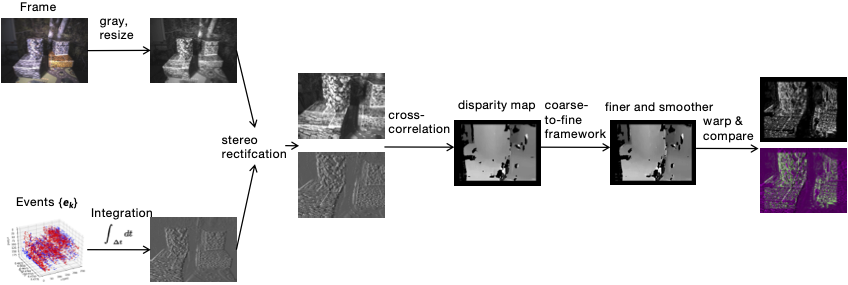
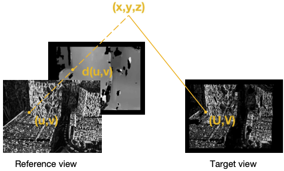
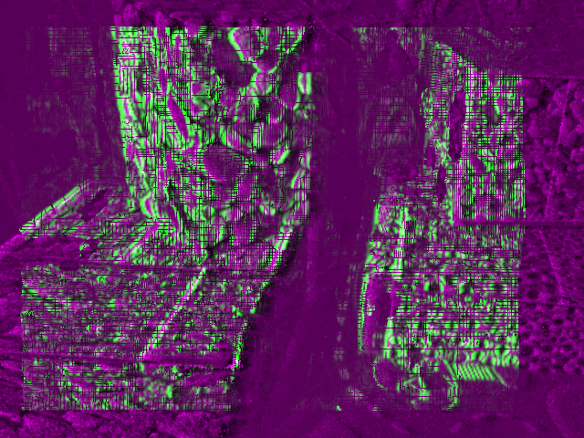

# Stereo Disparity Estimation

- based on stereo disparity estimation algorithm proposed by Stereo Hybrid Event-Frame (SHEF) Cameras for 3D Perception

- a semester project on event-based robot vision by Nan Cai, supervised by Prof. Dr. Guillermo Gallego. 
- The report explores the use of event and frame cameras for disparity estimation 

## Result

We use image warping process in above to evaluate the quality of the estimated disparity map

The right image (event, marked in green) is warped to the
left (frame, marked in purple) image